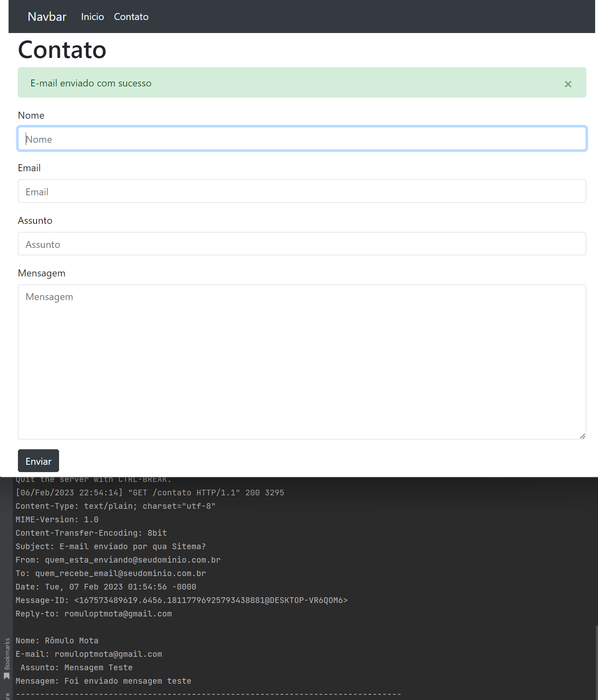

# Criação de uma pagina de contato  
 

### Descrição:
Uma página de contato é o local no seu site onde um visitante acessa para poder entrar em contato com você.
Nisso nesse arquivo foi criado o back-end desta pagina, com um front-ent basico somente para vermos o funcionamento. 

### O que foi feito:

- Criado projeto e aplicação
- Configurado settings (allowed, app, dirs, linguagem, zone )
- Criado templates (separados base, home, contato)
- Criado navbar (funcional - navegação home, inicio)
- Criado forms (class criação formulario e função envio e-mail)
- Criado views ( envio de formuario aos templates, validação post e mensagens)
- Modificado os templates para usar bootstra4 
- Configuração do settings (e-mail back-end)

### Observações:
- Esta pagina não foi realizado o deploy para não haver gastos desnecessarios, pois seria necessario um serviço de e-mail, porem foi configurado para simular a função de envio.
- Foi usado a função nativa do prorpio django em settings 'django.core.mail.backends.console.EmailBackend'
- E no proprio settings foi deixado a pré configuração para o uso de um servidor/serviço de e-mail

### Exemplo visual com retorno no terminal:

